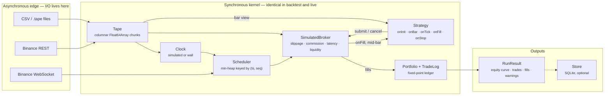

# Tapedeck

An event-driven backtesting and paper-trading engine for TypeScript. Deterministic by
construction, honest about what it cannot know, and fast enough that a million bars is not a
coffee break.

> **Status: phase 1 of 6.** The core is done — events, clock, replay, simulated broker, portfolio,
> trade extraction — with 210 tests and 96% statement coverage. Indicators, metrics, data adapters,
> the CLI and live paper trading are on the roadmap below. Nothing is published to npm yet.

## Why this exists

Most backtesters lie in one of three ways, and all three are structural rather than accidental:

1. **They let a strategy act on information it did not have.** A bar arrives, the strategy reads
   its close, and the engine fills the resulting order at that same close.
2. **They resolve intrabar ambiguity in the strategy's favour.** When a stop and a target both sit
   inside one bar's range, the engine quietly picks one — and it is rarely the stop.
3. **They keep money in floating point.** Across a few hundred thousand fills, the reported PnL
   stops reconciling with the sum of the trades.

Tapedeck is built so that none of the three is expressible. An order submitted while processing a
bar carries an activation time strictly after that bar; ambiguity is resolved by an explicit,
pessimistic-by-default policy and **counted in the run statistics**; money is fixed-point integers
all the way to the ledger. When the engine cannot know something — sub-bar latency on candle data,
which side of a bar traded first — it says so in the result rather than inventing a number.

The second goal is that a strategy runs unchanged in backtest and in live paper trading. That is
not a compatibility layer: both modes share one synchronous kernel, and only two things differ —
which clock answers `now()` and who fills the event queue.

## Architecture



Per bar, in this order and for these reasons:

| Step | What happens         | Why it is here                                              |
| ---- | -------------------- | ----------------------------------------------------------- |
| 1    | Drain the scheduler  | Orders whose latency has elapsed enter the book             |
| 2    | Advance the clock    | Simulated time becomes this bar's close                     |
| 3    | Match resting orders | Yesterday's stop is honoured before today's decision        |
| 4    | Mark to market       | The strategy sees an account priced at this bar             |
| 5    | `onBar`              | The strategy decides; what it submits is active from now on |
| 6    | Record equity        | One point per bar, into a preallocated column               |

Step 3 before step 5 is the whole game: in production a resting order fills whether or not your
strategy is awake.

## Quickstart

```bash
corepack enable pnpm && pnpm install && pnpm build && pnpm test && pnpm bench
```

Then run the example strategy end to end:

```bash
node examples/sma-crossover/src/main.ts
```

Node 24 strips the types natively, so every file in this repository runs without a build step.
If `corepack enable pnpm` needs administrator rights on your machine, `corepack pnpm install`
works just as well.

## What a strategy looks like

```ts
import { type Strategy, asQty } from '@tapedeck/core';

export function buyTheDip(): Strategy<{ drop: number }> {
  let threshold = 0;

  return {
    id: 'buy-the-dip',

    onInit(ctx, params) {
      threshold = params.drop;
      ctx.log.info('armed', { threshold });
    },

    onBar(bar, ctx) {
      // `bar` is a reused view. Read it, never keep it — under test the object is revoked when
      // this callback returns, so keeping it throws instead of silently reading the future.
      if (bar.close > bar.open - threshold) return;
      if (ctx.portfolio.position(bar.instrumentId).qty !== 0) return;

      ctx.signal(bar.instrumentId, 'long');
      ctx.submit({
        instrumentId: bar.instrumentId,
        side: 'buy',
        type: 'market',
        qty: asQty(1),
      });
    },
  };
}
```

Every hook is synchronous and returns `void`. That is deliberate: a strategy that can `await` is a
strategy whose event ordering depends on the event-loop scheduler, and a backtest whose ordering is
scheduler-dependent is not reproducible ([ADR-0003](docs/adr/0003-synchronous-deterministic-kernel.md)).

## Benchmark

One million bars, five runs each, median reported. Reproduce with `pnpm bench`.

| Scenario              | Throughput    | Per bar | What runs                                                     |
| --------------------- | ------------- | ------- | ------------------------------------------------------------- |
| replay only           | 25.5 M bars/s | 39 ns   | clock, scheduler, mark-to-market, equity curve                |
| + two moving averages | 15.7 M bars/s | 64 ns   | incremental indicators on every bar                           |
| + resting limit order | 8.5 M bars/s  | 118 ns  | order matcher runs on every bar                               |
| + crossover trading   | 9.8 M bars/s  | 102 ns  | indicators, orders, fills, PnL                                |
| development mode      | 8.0 M bars/s  | 125 ns  | guarded bar views and data validation, as the test suite runs |

Measured on Node 24.12 / Windows 11 / x64. A single headline figure would be marketing: replaying
bars, updating indicators, matching resting orders and actually trading are four different
workloads, so the benchmark reports all four. The target was one million bars per second.

The speed comes from three decisions, not from micro-optimisation: bars live in `Float64Array`
columns instead of objects, the bar handed to a strategy is refilled rather than reallocated, and
the fixed-point helpers take a plain-integer path whenever every intermediate is exactly
representable, falling back to `bigint` only when it is not.

## Design decisions and trade-offs

Each of these is an [ADR](docs/adr/) with the alternatives that were rejected and why.

- **[Fixed-point money, float indicators](docs/adr/0002-fixed-point-money-float-indicators.md).**
  Prices, quantities and money are scaled integers; indicators compute in `float64` because an
  indicator produces a signal, not money. The ledger stores a **cost basis in money**, not an
  average entry price — the first property test written against the portfolio found that a rounded
  average makes `equity` and `realised + unrealised - commission` disagree.
- **[A synchronous kernel](docs/adr/0003-synchronous-deterministic-kernel.md).** Asynchrony is
  confined to the edges. The cost: a strategy cannot do I/O inside a callback.
- **[Columnar tape and reused bar views](docs/adr/0004-columnar-tape-and-reused-bar-views.md).**
  The literal "one event object per bar" design caps out around 300k bars/s. The cost: a strategy
  must not retain the bar, which a revocable `Proxy` enforces in every test run.
- **[Intrabar execution](docs/adr/0005-intrabar-execution-and-no-lookahead.md).** Ambiguity is
  resolved by policy and counted. `stats.ambiguousBars` and `stats.subBarLatencyIgnored` are
  printed above the results, on purpose.
- **[Determinism and its limits](docs/adr/0006-determinism-guarantees-and-limits.md).** The trade
  list, equity curve and fill log are byte-identical across machines and chunkings. Derived metrics
  use `Math.pow`, which is not specified to the last bit, so they are compared at a documented
  tolerance instead. Saying so is the point.

## Determinism, precisely

Same data, same configuration, same seed produces an identical trade list, equity curve and fill
log — regardless of how the input was chunked and regardless of the machine. It is enforced, not
hoped for:

- `Date.now()`, `new Date()`, `Math.random()` and `performance.now()` are blocked by lint inside
  the core. Time comes from an injected `Clock`, randomness from a seeded `Rng`.
- Random streams are **forked by label**, so adding a component that consumes randomness cannot
  shift another component's sequence.
- Events carry `(timestamp, seq)`: a total order in which no two events compare equal.
- A test feeds the same dataset as one chunk and as 37 chunks and compares the serialized results
  byte for byte. CI runs the suite on Linux and Windows for the same reason.

## Testing

```bash
pnpm test          # 210 tests
pnpm coverage      # 96% statements, 87% branches on the core; 85% is the CI floor
pnpm lint          # no `any`, no `@ts-ignore`, no wall clock in the core
pnpm typecheck     # strict, plus noUncheckedIndexedAccess and exactOptionalPropertyTypes
```

Property tests (fast-check) cover the pieces where a hand-written case would only prove what the
author already believed: the fixed-point arithmetic, the equity identity across arbitrary fill
sequences, the scheduler's ordering, and the agreement between the fast and `bigint` paths.

A dedicated suite in [`lookahead.test.ts`](packages/core/test/lookahead.test.ts) is written as a
set of attacks: strategies that try to keep a bar, reach the tape, act on a jump as it prints, or
chain an order from inside `onFill`. A no-lookahead guarantee that nobody tried to break is not
worth stating.

## Roadmap

- [x] **Phase 1 — core.** Events, clock, scheduler, columnar tape, simulated broker (market, limit,
      stop, stop-limit; partial fills; TIF; slippage, commission, latency and liquidity models),
      fixed-point portfolio, trade extraction, tick support, SMA-crossover smoke strategy.
- [ ] **Phase 2 — indicators and metrics.** Incremental SMA, EMA, RSI, ATR, Bollinger, VWAP, MACD.
      Return, CAGR, Sharpe, Sortino, max drawdown and duration, profit factor, win rate,
      expectancy, exposure. JSON output.
- [ ] **Phase 3 — data and CLI.** CSV, Binance historical, a columnar `.tape` format, `Store` on
      `node:sqlite`, the `tapedeck` CLI, and a static HTML report with charts.
- [ ] **Phase 4 — paper trading.** Binance WebSocket feeding the same kernel, crash-recoverable
      state, no credentials in the repository.
- [ ] **Phase 5 — polish.** Published benchmark history, full documentation, npm release.
- [ ] **Phase 6 — B3.** Session calendar and holidays, continuous contracts and expiry rolls,
      real ported strategies.

Not planned, and deliberately so: a strategy DSL, a GUI, or a "no-code" layer. This is a library.

## Licence

MIT — see [LICENSE](LICENSE).

Nothing here is financial advice, and a backtest is not a prediction. The engine's job is to make
its own assumptions visible so you can decide how much to believe it.
