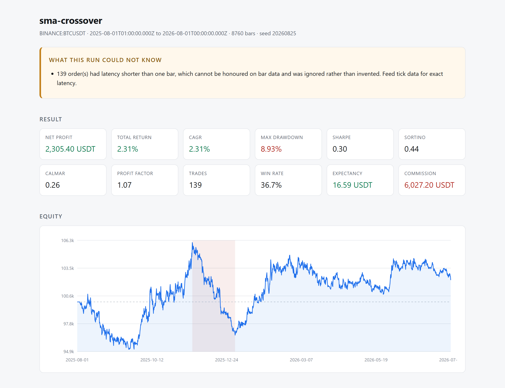
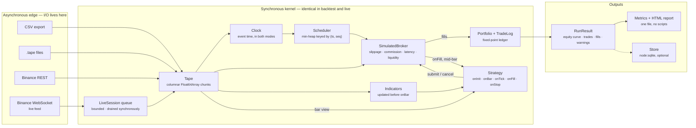

# Tapedeck

[](https://github.com/naderfilho/Tapedeck/actions/workflows/ci.yml)


[](LICENSE)

An event-driven backtesting and paper-trading engine for TypeScript. Deterministic by
construction, honest about what it cannot know, and fast enough that a million bars is not a
coffee break.

[](docs/images/report-full.png)

That is the real output of `node examples/sma-crossover/src/main.ts` on a committed year of hourly
BTCUSDT — one self-contained HTML file, no scripts and no network. The box at the top is the point
of the whole project: **what this run could not know, printed above the numbers it qualifies**, not
in a footnote. [The rest of the page](docs/images/report-full.png) carries the drawdown, the trade
distribution, the exact execution configuration and every trade.

> **Status: phase 4 of 6.** The kernel, the indicator library, the data adapters, the SQLite store,
> the metrics and report package, the `tapedeck` command line and live paper trading are done —
> 476 tests, 97% statement coverage, and a committed year of real BTCUSDT candles so that
> `pnpm test` measures something. Polish and the B3 session calendar are on the roadmap below.
> Nothing is published to npm yet.

## Why this exists

Most backtesters lie in one of three ways, and all three are structural rather than accidental:

1. **They let a strategy act on information it did not have.** A bar arrives, the strategy reads
   its close, and the engine fills the resulting order at that same close.
2. **They resolve intrabar ambiguity in the strategy's favour.** When a stop and a target both sit
   inside one bar's range, the engine quietly picks one — and it is rarely the stop.
3. **They keep money in floating point.** Across a few hundred thousand fills, the reported PnL
   stops reconciling with the sum of the trades.

Tapedeck is built so that none of the three is expressible. An order submitted while processing a
bar carries an activation time strictly after that bar; ambiguity is resolved by an explicit,
pessimistic-by-default policy and **counted in the run statistics**; money is fixed-point integers
all the way to the ledger. When the engine cannot know something — sub-bar latency on candle data,
which side of a bar traded first — it says so in the result, above the numbers it qualifies.

The second goal is that a strategy runs unchanged in backtest and in live paper trading. That is
not a compatibility layer: both modes share one synchronous kernel, and the only real difference is
who fills the event queue — a file, or a socket. Both run on event time; the wall clock measures
how far behind a live session is and reports it, and never decides when an order may fill.

## Quickstart

```bash
corepack enable pnpm && pnpm install && pnpm build && pnpm test && pnpm bench
```

Then replay a year of real hourly BTCUSDT and write a report:

```bash
node examples/sma-crossover/src/main.ts
```

That prints the summary below and leaves `out/report.html` — one self-contained page with the
equity curve, the drawdown and the trade distribution — next to `out/metrics.json`.

```text
Modelling caveats
  ! 139 order(s) had latency shorter than one bar, which cannot be honoured on bar data and was
    ignored rather than invented. Feed tick data for exact latency.

Result
  initial equity        100000.00000000 USDT
  final equity          102305.39899000 USDT
  net profit            2305.39899000 USDT
  CAGR                  2.31%

Risk
  Sharpe                0.30
  Sortino               0.44
  max drawdown          8.93% (9469.85413000 USDT, 6062 bars)

Trades
  count                 139 (51W / 88L)
  win rate              36.7%
  profit factor         1.07

Costs
  commission            6027.20101000 USDT
  PnL before costs      8332.60000000 USDT
  costs ate             72.3%
```

That last line is the point of the exercise. A 24/72 crossover on hourly BTC made 8,332 before
costs and kept 2,305 of it; a backtester that skipped fees would have reported a strategy three and
a half times better than the one that exists.

Node 24 strips the types natively, so every file in this repository runs without a build step. If
`corepack enable pnpm` needs administrator rights, `corepack pnpm install` works just as well.

## The command line

```bash
# Replay a strategy over a tape and write everything
tapedeck run examples/sma-crossover/src/strategy.ts \
  --data fixtures/binance-BTCUSDT-1h.tape \
  --preset binanceSpot --seed 20260825 \
  --params '{"fastPeriod":24,"slowPeriod":72,"qty":25000}' \
  --result out/run.json --json out/metrics.json --html out/report.html

# Re-render a run you saved months ago, with today's metric definitions
tapedeck report out/run.json --html out/report.html --risk-free-rate 0.05

# Fetch public candles, or convert a CSV export you already have
tapedeck data fetch --symbol BTCUSDT --timeframe 1h \
  --from 2025-08-01T00:00:00Z --to 2026-08-01T00:00:00Z --out data/btc.tape
tapedeck data convert exported.csv --instrument win.json --timeframe 1m --out data/win.tape

# Point the same strategy at a live public feed, against the simulated broker
tapedeck paper examples/sma-crossover/src/strategy.ts \
  --symbol BTCUSDT --timeframe 1m --preset binanceSpot \
  --params '{"fastPeriod":24,"slowPeriod":72,"qty":25000}' \
  --store out/paper.sqlite --session btc-sma --duration 3600 \
  --html out/paper.html
```

A strategy is a module you point at, not a name in a registry — a strategy is code, and pretending
otherwise means inventing a plugin system nobody asked for.

## Paper trading

`run` and `paper` load the same module, drive the same kernel and write the same report. The
strategy is not told which one it is running under, because there is nothing it could correctly do
with the answer.

What differs is who fills the queue — a file, or a WebSocket handler that enqueues and calls the
same synchronous `drain()` a backtest calls. The kernel runs on **event time** in both cases
([ADR-0014](docs/adr/0014-paper-trading-runs-on-event-time.md)); the wall clock is used to measure
how far behind the session is, and that number is reported rather than folded into execution.

Here is a real fifteen-second session against the live Binance socket, unedited:

```text
paper   BINANCE:BTCUSDT  tick
session BTCUSDT-binanceSpot
feed    connecting (attempt 1)
feed    connected wss://stream.binance.com:9443/stream?streams=btcusdt@aggTrade
feed    feed closed

stopped: duration elapsed

what this session could not know
  - 117 event(s) arrived stamped up to 0.466s in the future of this machine's clock, which
    they cannot be: this clock is behind the venue's by at least that much. Every lag number
    here is off by the same amount, so read them as a diagnostic and fix the local clock
    before believing them.

events  131 processed, 0 refused, queue peaked at 1
lag     -0.466s .. -0.405s over 117 event(s), last -0.462s
```

That warning is the first real connection paying for itself. A lag statistic that clamped negative
readings to zero would have reported a comfortable `0.000s` and hidden a machine whose clock is
half a second out; the 61 ms spread between the two ends of the range is the jitter that is
actually measurable, and the offset is not lag at all.

Three things it will not do quietly:

- **Drop events.** The queue has a cap; at the cap the session refuses events and counts the
  refusals. It never drops the oldest, never drops the newest, and never reorders.
- **Hide a gap.** A reconnection reports how much tape it missed.
- **Touch a credential.** The feed is public market data and the broker is the simulator. The URL
  builder refuses anything carrying a listen key, an API key or a signature
  ([ADR-0011](docs/adr/0011-read-only-market-data.md)).

`--store` with `--session` makes a session resumable. What comes back is the **account** — cash,
the cost basis of every open position, the resting orders, and the order and fill counters so the
audit trail continues. Resuming a real session mid-position, in a second process, blends the new
fills into the existing cost basis and numbers the next fill 10 rather than 1 — which is what the
counters are for: `paper_fills` is keyed by `(session, fillId)`, so a restart that began again at 1
would overwrite a trade instead of recording one. What does not come back is the strategy's own memory: a field in a closure
is gone, and `bar.index` restarts because it counts this run's bars. A strategy meant to survive a
restart derives its state from event time, from its fills and from `ctx.portfolio`. The session
says so in its warnings every time it resumes.

## Architecture



Per bar, in this order and for these reasons:

| Step | What happens         | Why it is here                                              |
| ---- | -------------------- | ----------------------------------------------------------- |
| 1    | Drain the scheduler  | Orders whose latency has elapsed enter the book             |
| 2    | Advance the clock    | Simulated time becomes this bar's close                     |
| 3    | Match resting orders | Yesterday's stop is honoured before today's decision        |
| 4    | Mark to market       | The strategy sees an account priced at this bar             |
| 5    | Update indicators    | So a value read in `onBar` belongs to the bar being shown   |
| 6    | `onBar`              | The strategy decides; what it submits is active from now on |
| 7    | Record equity        | One point per bar, into a preallocated column               |

Step 3 before step 6 is the whole game: in production a resting order fills whether or not your
strategy is awake.

## Packages

| Package                | What it is                                                          | Runtime dependencies |
| ---------------------- | ------------------------------------------------------------------- | -------------------- |
| `@tapedeck/core`       | Events, clock, scheduler, tape, simulated broker, portfolio, engine | none                 |
| `@tapedeck/indicators` | Incremental SMA, EMA, RMA, RSI, ATR, Bollinger, VWAP, MACD          | none                 |
| `@tapedeck/data`       | CSV, Binance REST and WebSocket, the columnar `.tape` format        | `zod`                |
| `@tapedeck/report`     | Metrics, JSON output, and a self-contained HTML report              | none                 |
| `@tapedeck/store`      | Bar cache, run history and paper state on `node:sqlite`             | none                 |
| `@tapedeck/cli`        | The `tapedeck` command                                              | `commander`, `zod`   |

The dependency arrows only ever point inward: `core` declares the contracts — `Strategy`,
`Broker`, `DataProvider`, `Indicator`, `Store` — and imports no other workspace package.

## What a strategy looks like

```ts
import { type IndicatorHandle, type Strategy, asQty } from '@tapedeck/core';
import { atr, rsi } from '@tapedeck/indicators';

export default function meanReversion(): Strategy<{ oversold: number }> {
  let strength: IndicatorHandle;
  let volatility: IndicatorHandle;
  let threshold = 0;

  return {
    id: 'mean-reversion',

    onInit(ctx, params) {
      threshold = params.oversold;
      // The engine updates these once per bar, before onBar. There is no update to forget.
      strength = ctx.use(rsi({ period: 14 }));
      volatility = ctx.use(atr({ period: 14 }));
    },

    onBar(bar, ctx) {
      // `bar` is a reused view. Read it, never keep it — under test the object is revoked when
      // this callback returns, so keeping it throws instead of silently reading the future.
      if (strength.value === null || volatility.value === null) return;
      if (strength.value > threshold) return;
      if (ctx.portfolio.position(bar.instrumentId).qty !== 0) return;

      ctx.signal(bar.instrumentId, 'long');
      ctx.submit({
        instrumentId: bar.instrumentId,
        side: 'buy',
        type: 'market',
        qty: asQty(1),
      });
    },
  };
}
```

Every hook is synchronous and returns `void`. That is deliberate: a strategy that can `await` is a
strategy whose event ordering depends on the event-loop scheduler, and a backtest whose ordering is
scheduler-dependent is not reproducible ([ADR-0003](docs/adr/0003-synchronous-deterministic-kernel.md)).

## Metrics

Return, CAGR, Sharpe, Sortino, Calmar, volatility, max drawdown with its depth _and_ its duration,
longest drawdown, recovery factor, profit factor, win rate, expectancy, average and largest win and
loss, exposure, and what costs took out of the pre-cost result.

Two rules make those numbers checkable:

- **Every convention is stated where it is computed.** Sortino divides by downside deviation over
  _all_ periods; profit factor is measured after commission, consistent with how trades were
  classified; bars per year comes from the _median_ spacing of the equity curve, so a market that
  closes overnight is not defined by its gaps ([ADR-0012](docs/adr/0012-metric-conventions.md)).
- **A metric that cannot be computed reports `null`.** A profit factor with no losses, a Sharpe
  from one bar, a CAGR over a zero-length run. Zero is a result; nothing is not.

Money never becomes a float on the way out: every monetary field in the JSON is an exact decimal
string, and every ratio is rounded to twelve significant digits — which is what makes two runs of
the same configuration produce byte-identical metrics on any machine, despite `Math.pow`.

## Data

Three sources, one contract:

```ts
import { BinanceDataProvider, CsvBarProvider, readBarTapeFile } from '@tapedeck/data';

// Public endpoints only. The provider has no concept of an API key, so it cannot place an order.
const binance = new BinanceDataProvider();
const instrument = await binance.describe('BTCUSDT'); // scales come from the venue's own filters
for await (const chunk of binance.bars({ symbol: 'BTCUSDT', timeframe, from, to })) {
  engine.feedBars(chunk);
}

// Or read the committed fixture: one readFile, no parsing, columns are views over the buffer.
const { chunk } = await readBarTapeFile('fixtures/binance-BTCUSDT-1h.tape');
```

Prices travel from the venue to `parseFixed` **as strings** and become integers exactly once. A
candle that has not finished forming is dropped rather than truncated, because letting one through
is a quiet way to hand a strategy the future.

The repository ships a year of hourly BTCUSDT — 8,760 bars, 480 KiB, fetched between two fixed
dates so the file never drifts. B3 data is neither public nor redistributable, so every B3 example
points at a file you fetched yourself ([ADR-0011](docs/adr/0011-read-only-market-data.md)).

## Benchmark

One million bars, five runs each, median reported. Reproduce with `pnpm bench`.

| Scenario              | Throughput    | Per bar | What runs                                                     |
| --------------------- | ------------- | ------- | ------------------------------------------------------------- |
| replay only           | 26.5 M bars/s | 38 ns   | clock, scheduler, mark-to-market, equity curve                |
| + two moving averages | 9.1 M bars/s  | 110 ns  | two library indicators updated on every bar                   |
| + resting limit order | 8.6 M bars/s  | 117 ns  | order matcher runs on every bar                               |
| + crossover trading   | 7.6 M bars/s  | 132 ns  | indicators, orders, fills, PnL                                |
| development mode      | 4.0 M bars/s  | 250 ns  | guarded bar views and data validation, as the test suite runs |

Measured on Node 24.12 / Windows 11 / x64. A single headline figure would be marketing: replaying
bars, updating indicators, matching resting orders and actually trading are four different
workloads, so the benchmark reports all four. The target was one million bars per second.

Two of those numbers are trade-offs rather than achievements. Registering indicators through
`ctx.use` costs roughly 20 nanoseconds per indicator per bar against calling a class directly — the
price of an abstraction that makes reading a stale value impossible. Development mode is half the
speed of production because guarded bar views and per-chunk validation are on; that is what the
test suite runs at, on purpose.

The speed comes from decisions, not micro-optimisation: bars live in `Float64Array` columns instead
of objects, the bar handed to a strategy is refilled rather than reallocated, the fixed-point
helpers take a plain-integer path whenever every intermediate is exactly representable, and no
indicator allocates on the hot path.

## Design decisions and trade-offs

Each of these is an [ADR](docs/adr/) with the alternatives that were rejected and why.

- **[Fixed-point money, float indicators](docs/adr/0002-fixed-point-money-float-indicators.md).**
  The ledger stores a **cost basis in money**, not an average entry price — the first property test
  written against the portfolio found that a rounded average makes `equity` and
  `realised + unrealised - commission` disagree.
- **[A synchronous kernel](docs/adr/0003-synchronous-deterministic-kernel.md).** Asynchrony is
  confined to the edges. The cost: a strategy cannot do I/O inside a callback.
- **[Paper trading on event time](docs/adr/0014-paper-trading-runs-on-event-time.md).** The wall
  clock measures lag; it never decides when an order becomes matchable. Building this amended
  ADR-0003, which had claimed the live clock drives the kernel — it cannot, or the same events
  would fill differently on a machine two seconds fast.
- **[Columnar tape and reused bar views](docs/adr/0004-columnar-tape-and-reused-bar-views.md).**
  The literal "one event object per bar" design caps out around 300k bars/s. The cost: a strategy
  must not retain the bar, which a revocable `Proxy` enforces in every test run.
- **[Intrabar execution](docs/adr/0005-intrabar-execution-and-no-lookahead.md).** Ambiguity is
  resolved by policy and counted.
- **[Determinism and its limits](docs/adr/0006-determinism-guarantees-and-limits.md).** The trade
  list, equity curve and fill log are byte-identical across machines and chunkings; derived metrics
  are compared at a documented tolerance instead. Saying so is the point.
- **[A `.tape` format instead of Parquet](docs/adr/0009-tape-binary-format.md).** The engine scans
  columns forwards, once. Parquet's strengths cost two megabytes of WebAssembly and buy nothing.
- **[The indicator contract](docs/adr/0010-indicator-contract.md).** The engine owns the update, so
  a value read inside `onBar` always belongs to the bar being shown.
- **[Metric conventions](docs/adr/0012-metric-conventions.md)** and
  **[a report is a file, not an application](docs/adr/0013-report-is-a-file.md).** No `<script>`,
  no CDN, no network: a report should still open in five years, from a USB stick.

## Determinism, precisely

Same data, same configuration, same seed produces an identical trade list, equity curve and fill
log — regardless of how the input was chunked and regardless of the machine. It is enforced, not
hoped for:

- `Date.now()`, `new Date()`, `Math.random()` and `performance.now()` are blocked by lint inside
  `packages/core/src`. Time comes from an injected `Clock`, randomness from a seeded `Rng`.
  Adapters may read the wall clock, because that is their job.
- Random streams are **forked by label**, so adding a component that consumes randomness cannot
  shift another component's sequence.
- Events carry `(timestamp, seq)`: a total order in which no two events compare equal.
- A test feeds the same dataset as one chunk and as 37 chunks and compares the serialized results
  byte for byte. CI runs the suite on Linux and Windows for the same reason.

## Testing

```bash
pnpm test          # 476 tests
pnpm coverage      # 97% statements, 97% functions; 85% is the floor for every package
pnpm lint          # no `any`, no `@ts-ignore`, no wall clock in the kernel
pnpm typecheck     # strict, plus noUncheckedIndexedAccess and exactOptionalPropertyTypes
```

Property tests (fast-check) cover the pieces where a hand-written case would only prove what the
author already believed, and four of them changed the design rather than confirming it:

- the equity identity across arbitrary fill sequences, which found that deriving PnL from a rounded
  average entry price does not reconcile;
- the agreement between the fast integer path and the `bigint` path in the fixed-point helpers,
  which found a signed zero leaking out of one of them;
- the incremental indicators against a deliberately naive full recomputation, which found that a
  single outlier passing through a rolling window poisons the variance until the accumulator is
  rebuilt;
- the intrabar ordering, which found that comparing a buy's "favourability" against a sell's is not
  a comparison at all.

A dedicated suite in [`lookahead.test.ts`](packages/core/test/lookahead.test.ts) is written as a
set of attacks: strategies that try to keep a bar, reach the tape, act on a jump as it prints, or
chain an order from inside `onFill`. A no-lookahead guarantee that nobody tried to break is not
worth stating.

## Roadmap

- [x] **Phase 1 — core.** Events, clock, scheduler, columnar tape, simulated broker (market, limit,
      stop, stop-limit; partial fills; TIF; slippage, commission, latency and liquidity models),
      fixed-point portfolio, trade extraction, tick support.
- [x] **Phase 2 — indicators and data.** Incremental indicators behind one contract the engine
      drives; CSV and Binance providers; the `.tape` format; the SQLite store; a committed year of
      real BTCUSDT.
- [x] **Phase 3 — metrics, report and CLI.** Full metric set with stated conventions, JSON output,
      a self-contained HTML report with charts, and the `tapedeck` command.
- [x] **Phase 4 — paper trading.** Binance WebSocket feeding the same kernel through a queue whose
      depth and lag are reported, heartbeats so a quiet market still moves time, crash-recoverable
      sessions, and `tapedeck paper`. No credentials, anywhere.
- [ ] **Phase 5 — polish.** Published benchmark history, a recorded walkthrough of the report,
      full API documentation, npm release.
- [ ] **Phase 6 — B3.** Session calendar and holidays, continuous contracts and expiry rolls,
      real ported strategies.

Not planned, and deliberately so: a strategy DSL, a GUI, or a "no-code" layer. This is a library.

## Licence

MIT — see [LICENSE](LICENSE).

Nothing here is financial advice, and a backtest is not a prediction. The engine's job is to make
its own assumptions visible so you can decide how much to believe it.
