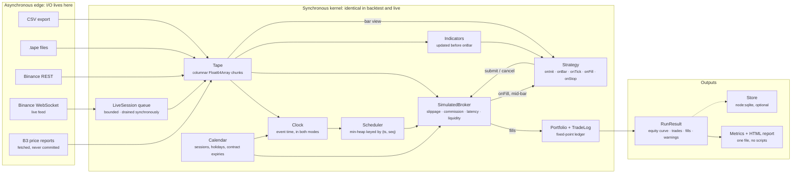

# Tapedeck

[](https://github.com/naderfilho/Tapedeck/actions/workflows/ci.yml)


[](LICENSE.md)

An event-driven backtesting and paper-trading engine for TypeScript. Deterministic by
construction, explicit about what it cannot know, and quick enough to replay a million bars in
about 140 ms while trading them.

It runs in a browser tab, which is unusual for this kind of engine and is the fastest way to judge
it. How it compares to NautilusTrader, LEAN, VectorBT and backtrader is
[further down](#where-this-sits), and so is [why it is TypeScript](#why-typescript-and-what-it-costs).

[](https://tapedeck-nader-filhos-projects.vercel.app/report/)

**[Run a backtest in your browser →](https://tapedeck-nader-filhos-projects.vercel.app/demo/)**. Twelve
markets across two exchanges, three strategies, three bar clocks; change anything and the engine
re-runs in the tab, on the same kernel the CLI uses. Free, no account, nothing uploaded. It works
because `core` has zero runtime dependencies and imports nothing from `node:`; portability fell out
of a rule made for reproducibility. **[The report above is here](https://tapedeck-nader-filhos-projects.vercel.app/report/)**,
rebuilt by CI from the committed fixture on every push so it cannot drift from the code.

That is the output of `node examples/sma-crossover/src/main.ts` on a committed year of hourly
BTCUSDT: one self-contained HTML file, no scripts and no network. The box at the top is the point
of the whole project: **what this run could not know, printed above the numbers it qualifies**, not
in a footnote. Below the fold sit the drawdown, the trade distribution, the exact execution
configuration and every trade.

> **Status: seven phases done.** The kernel, the indicator library, the data adapters, the SQLite
> store, the metrics and report package, the `tapedeck` command line, paper trading against a live
> feed, the B3 layer and a second exchange are all in.
> 699 tests, 96% statement coverage, and a committed year of real candles from two exchanges so that
> `pnpm test` measures something. Not published to npm, deliberately; see
> [what this is for](#what-this-is-for).

Designed and built from scratch by [Nader Filho](https://github.com/naderfilho). The parts worth
checking first are the [property tests that changed the code](#testing) rather than confirming it,
the [ADR amended](docs/adr/0014-paper-trading-runs-on-event-time.md) after the first live connection
disproved it, and the [demo](https://tapedeck-nader-filhos-projects.vercel.app/demo/), which is the
engine itself rather than a recording of it. Every decision is argued in [19 ADRs](docs/adr/), each
with the alternatives that were rejected.

## Why this exists

Most backtesters lie in one of three ways, and all three are structural rather than accidental:

1. **They let a strategy act on information it did not have.** A bar arrives, the strategy reads
   its close, and the engine fills the resulting order at that same close.
2. **They resolve intrabar ambiguity in the strategy's favour.** When a stop and a target both sit
   inside one bar's range, the engine quietly picks one, and it is rarely the stop.
3. **They keep money in floating point.** Across a few hundred thousand fills, the reported PnL
   stops reconciling with the sum of the trades.

Tapedeck is built so that none of the three is expressible. An order submitted while processing a
bar carries an activation time strictly after that bar; ambiguity is resolved by an explicit,
pessimistic-by-default policy and **counted in the run statistics**; money is fixed-point integers
all the way to the ledger. When the engine cannot know something (sub-bar latency on candle data,
which side of a bar traded first) it says so in the result, above the numbers it qualifies.

The second goal is that a strategy runs unchanged in a backtest and against a live feed. Both modes
share one synchronous kernel and differ only in who fills the event queue: a file, or a socket.
Both run on event time; the wall clock measures how far behind a live session is and reports it,
and never decides when an order may fill. What that does **not** include is order routing to a real
venue — see [Paper trading](#paper-trading).

## Why TypeScript, and what it costs

Quant tooling lives in Python, C++ and Rust. This is TypeScript, and the choice buys one thing that
turned out to matter more than the rest: `@tapedeck/core` has no runtime dependencies and imports
nothing from `node:`, so the whole engine runs in a browser tab. The
[demo](https://tapedeck-nader-filhos-projects.vercel.app/demo/) is not a recording of the engine —
it is the engine, the same kernel over the same committed tapes calling the same report function as
the CLI. Evaluating this project costs a click rather than an install.

The same constraint keeps the report a single file with no network request, and holds the whole
workspace to two runtime dependencies — zod where data is parsed and commander in the CLI, neither
of them anywhere near the engine. One language covers the strategy, the metrics and
the page, and Node 24 strips the types, so every file here runs without a build step.

What it costs, plainly:

- **No NumPy, pandas, SciPy or statsmodels.** Anything statistical beyond the shipped metric set is
  yours to write.
- **No vectorised parameter sweeps.** A grid search is a loop over runs. At the 7.2 M bars/s the
  benchmark measures with trading, that is comfortable for hundreds of runs and the wrong tool for
  millions.
- **One core per run.** There is no multiprocessing story here.
- **It will not beat a Rust core on latency**, and does not try to. This is a research and
  simulation engine, not a low-latency execution stack.

## Where this sits

Tools that are older, larger and running real money already exist. This does not replace them.

| Project                                              | What it is                                                                    | Where it is stronger than this                                                                      |
| ---------------------------------------------------- | ----------------------------------------------------------------------------- | --------------------------------------------------------------------------------------------------- |
| [NautilusTrader](https://nautilustrader.io/)         | Rust core with a Python API, nanosecond event clock, adapters for real venues | Everything about going live: real order lifecycle, venue integrations, throughput, production users |
| [LEAN / QuantConnect](https://www.quantconnect.com/) | C# engine plus a hosted platform with data and brokerages                     | Data and broker coverage, and a backtest-to-live path where the strategy code does not change       |
| [VectorBT](https://vectorbt.dev/)                    | Vectorised NumPy backtesting                                                  | Parameter sweeps, by orders of magnitude                                                            |
| [backtrader](https://www.backtrader.com/)            | Mature event-driven Python framework                                          | Ecosystem, examples, and years of community answers                                                 |

Three things are different here:

- **The modelling assumptions are reported numbers, not footnotes.** Bars whose fill order could not
  be known, latency too short to honour on bar data, and what a timeframe aggregation had to leave
  out are printed above the result — in the terminal, in the report and on the site. That is the
  subject of this project rather than a feature of it.
- **It runs in a tab.** No install, no account, no container, and the demo is the engine.
- **It is small enough to read.** Six packages, zero runtime dependencies in the core, and an ADR
  for every decision that could reasonably have gone the other way.

If you need to trade real money this quarter, use one of the four above.

## Quickstart

```bash
corepack enable pnpm && pnpm install && pnpm build && pnpm test && pnpm bench
```

Then replay a year of real hourly BTCUSDT and write a report:

```bash
node examples/sma-crossover/src/main.ts
```

That prints the summary below and leaves `out/report.html` (one self-contained page with the
equity curve, the drawdown and the trade distribution) next to `out/metrics.json`.

```text
Modelling caveats
  ! 139 order(s) had latency shorter than one bar, which cannot be honoured on bar data and was
    ignored rather than invented. Feed tick data for exact latency.

Result
  initial equity        100000.00000000 USDT
  final equity          102305.39899000 USDT
  net profit            2305.39899000 USDT
  CAGR                  2.31%

Risk
  Sharpe                0.30
  Sortino               0.44
  max drawdown          8.93% (9469.85413000 USDT, 6062 bars)

Trades
  count                 139 (51W / 88L)
  win rate              36.7%
  profit factor         1.07

Costs
  commission            6027.20101000 USDT
  PnL before costs      8332.60000000 USDT
  costs ate             72.3%
```

The last line is why the example ships with costs on. A 24/72 crossover on hourly BTC made 8,332
before costs and kept 2,305 of it, so a backtester that skipped fees would have reported a strategy
three and a half times better than the one that exists.

The 36.7% win rate is not a defect either, and it is worth saying so before someone reads it as
one: trend following pays for a few large wins with many small losses, so the number that decides
whether it works is the profit factor. Sweep the periods across a 5&times;5 grid and thirteen of the
nineteen combinations lose money outright, which is the more useful lesson, and the reason the
example ships the parameters it started with rather than the ones that flattered it afterwards.

### Three strategies, on purpose

`examples/` ships three, chosen so that no two exercise the same part of the engine:

|                                              | What it does                                                                    | What it demonstrates                                                     |
| -------------------------------------------- | ------------------------------------------------------------------------------- | ------------------------------------------------------------------------ |
| [`sma-crossover`](examples/sma-crossover/)   | Long while the fast average is above the slow one                               | The baseline. One position, no resting orders.                           |
| [`breakout`](examples/breakout/)             | Channel breakout on above-average volume, bracketed with an ATR stop and target | Two resting orders on one bar, so `stats.ambiguousBars` stops being zero |
| [`mean-reversion`](examples/mean-reversion/) | Buys oversold, sells the bounce, with a time stop                               | Wins often and loses large, the crossover in reverse                     |

The last two are worth running side by side. On the committed year of BTCUSDT the breakout wins
37.8% of its trades and the reversion wins 56.2%, and both have a profit factor under one: ranking
them by win rate ranks them backwards.

The breakout is the one that earns its place in the test suite: its bracket is an OCO group, and
`examples/breakout/test` asserts that a bar containing both legs never executes both, and that the
run reports the bars whose fill order could not be known from bar data.

Node 24 strips the types natively, so every file in this repository runs without a build step. If
`corepack enable pnpm` needs administrator rights, `corepack pnpm install` works just as well.

## The command line

```bash
# Replay a strategy over a tape and write everything
tapedeck run examples/sma-crossover/src/strategy.ts \
  --data fixtures/binance-BTCUSDT-1h.tape \
  --preset binanceSpot --seed 20260825 \
  --params '{"fastPeriod":24,"slowPeriod":72,"qty":25000}' \
  --result out/run.json --json out/metrics.json --html out/report.html

# Re-render a run you saved months ago, with today's metric definitions
tapedeck report out/run.json --html out/report.html --risk-free-rate 0.05

# Fetch public candles, or convert a CSV export you already have
tapedeck data fetch --symbol BTCUSDT --timeframe 1h \
  --from 2025-08-01T00:00:00Z --to 2026-08-01T00:00:00Z --out data/btc.tape
tapedeck data convert exported.csv --instrument win.json --timeframe 1m --out data/win.tape

# Point the same strategy at a live public feed, against the simulated broker
tapedeck paper examples/sma-crossover/src/strategy.ts \
  --symbol BTCUSDT --timeframe 1m --preset binanceSpot \
  --params '{"fastPeriod":24,"slowPeriod":72,"qty":25000}' \
  --store out/paper.sqlite --session btc-sma --duration 3600 \
  --html out/paper.html
```

A strategy is a module you point at rather than a name in a registry, which is why there is no
plugin system to configure.

## Paper trading

`run` and `paper` load the same module, drive the same kernel and write the same report. The
strategy is not told which one it is running under, because there is nothing it could correctly do
with the answer.

**What this is and is not.** The market data is real and live. The broker is the same simulator the
backtest uses. So the hard half of live trading is untouched: no order is sent to a venue, and there
is no acknowledgement, no rejection, no exchange-side partial fill, no rate limit to respect and no
reconciliation between local state and an account at the exchange. Those are the parts that break in
production. They are absent by design — the provider has no concept of a credential
([ADR-0011](docs/adr/0011-read-only-market-data.md)) — but absent is absent, and "live" here means a
live feed, not live execution.

What differs is who fills the queue: a file, or a WebSocket handler that enqueues and calls the
same synchronous `drain()` a backtest calls. The kernel runs on **event time** in both cases
([ADR-0014](docs/adr/0014-paper-trading-runs-on-event-time.md)); the wall clock is used to measure
how far behind the session is, and that number is reported rather than folded into execution.

Here is a real fifteen-second session against the live Binance socket, unedited:

```text
paper   BINANCE:BTCUSDT  tick
session BTCUSDT-binanceSpot
feed    connecting (attempt 1)
feed    connected wss://stream.binance.com:9443/stream?streams=btcusdt@aggTrade
feed    feed closed

stopped: duration elapsed

what this session could not know
  - 117 event(s) arrived stamped up to 0.466s in the future of this machine's clock, which
    they cannot be: this clock is behind the venue's by at least that much. Every lag number
    here is off by the same amount, so read them as a diagnostic and fix the local clock
    before believing them.

events  131 processed, 0 refused, queue peaked at 1
lag     -0.466s .. -0.405s over 117 event(s), last -0.462s
```

That warning is the first real connection paying for itself. A lag statistic that clamped negative
readings to zero would have reported a comfortable `0.000s` and hidden a machine whose clock is
half a second out; the 61 ms spread between the two ends of the range is the jitter that is
actually measurable, and the offset is not lag at all.

Three things it will not do quietly:

- **Drop events.** The queue has a cap; at the cap the session refuses events and counts the
  refusals. It never drops the oldest, never drops the newest, and never reorders.
- **Hide a gap.** A reconnection reports how much tape it missed.
- **Touch a credential.** The feed is public market data and the broker is the simulator. The URL
  builder refuses anything carrying a listen key, an API key or a signature
  ([ADR-0011](docs/adr/0011-read-only-market-data.md)).

`--store` with `--session` makes a session resumable. What comes back is the **account**: cash,
the cost basis of every open position, the resting orders, and the order and fill counters so the
audit trail continues. Resuming a real session mid-position, in a second process, blends the new
fills into the existing cost basis and numbers the next fill 10 rather than 1, which is what the
counters are for: `paper_fills` is keyed by `(session, fillId)`, so a restart that began again at 1
would overwrite a trade instead of recording one. What does not come back is the strategy's own memory: a field in a closure
is gone, and `bar.index` restarts because it counts this run's bars. A strategy meant to survive a
restart derives its state from event time, from its fills and from `ctx.portfolio`. The session
says so in its warnings every time it resumes.

**[The API guide](docs/api.md)** covers the strategy contract, orders, execution models, the data
adapters, calendars and futures, and the six rules a strategy cannot break.

## Futures, sessions and B3

Crypto never closes, one symbol means the same thing next year, and a contract never expires. B3
breaks all three, and each break is a way for a backtest to be quietly wrong.

```bash
node examples/b3-rollover/src/main.ts
```

That runs the mini index across six contracts and five rolls. What it shows:

- **A session calendar.** B3 shuts at 18:00 in São Paulo and does not open on Carnival, which moves
  with Easter and is therefore computed rather than listed. A `day` order dies at the **session
  close**, not at midnight UTC. The old rule kept a Friday order alive into Saturday, a day nobody
  could have cancelled anything on.
- **Contracts as coordinates.** `WINJ25` exists for a few months. Expiries come from B3's own rules
  and are asserted in the tests against the dates the exchange actually used. "Front month" means
  the contract whose **roll** has not passed, not the nearest unexpired one; those differ for a few
  sessions before every expiry, and that window is where a backtest trades something illiquid.
- **A continuous series that admits what it is.** Back-adjustment is the default because it
  preserves point differences, which is what a futures PnL is made of. The stitcher warns that
  adjusted prices never traded, and refuses to be quiet when the adjustment pushes a bar below zero.
- **Costs that are citations.** `B3_TARIFFS` carries the exchange's published unit costs with a
  source URL and the date they were read. WDO is priced in **dollars**, so the model demands an
  exchange rate rather than inventing one.

The example runs on generated prices and says so loudly in its own output: B3's consumption policy
permits internal use and requires approval to redistribute, so no B3 price is committed here
([ADR-0015](docs/adr/0015-b3-sessions-contracts-and-data.md)). Fetch your own in one command and the
data stays on your machine:

```bash
tapedeck data fetch --venue b3 --symbol WIN --from 2025-08-01 --to 2026-08-01 -o data/win.tape
```

## Architecture



Per bar, in this order and for these reasons:

| Step | What happens         | Why it is here                                              |
| ---- | -------------------- | ----------------------------------------------------------- |
| 1    | Drain the scheduler  | Orders whose latency has elapsed enter the book             |
| 2    | Advance the clock    | Simulated time becomes this bar's close                     |
| 3    | Match resting orders | Yesterday's stop is honoured before today's decision        |
| 4    | Mark to market       | The strategy sees an account priced at this bar             |
| 5    | Update indicators    | So a value read in `onBar` belongs to the bar being shown   |
| 6    | `onBar`              | The strategy decides; what it submits is active from now on |
| 7    | Record equity        | One point per bar, into a preallocated column               |

Step 3 before step 6 is the whole game: in production a resting order fills whether or not your
strategy is awake.

## Packages

| Package                | What it is                                                          | Runtime dependencies |
| ---------------------- | ------------------------------------------------------------------- | -------------------- |
| `@tapedeck/core`       | Events, clock, calendar, tape, broker, contracts, portfolio, engine | none                 |
| `@tapedeck/indicators` | Incremental SMA, EMA, RMA, RSI, ATR, Bollinger, VWAP, MACD          | none                 |
| `@tapedeck/data`       | CSV, Binance and Coinbase REST, Binance socket, B3, `.tape`         | `zod`                |
| `@tapedeck/report`     | Metrics, JSON output, and a self-contained HTML report              | none                 |
| `@tapedeck/store`      | Bar cache, run history and paper state on `node:sqlite`             | none                 |
| `@tapedeck/cli`        | The `tapedeck` command                                              | `commander`, `zod`   |

The dependency arrows only ever point inward: `core` declares the contracts (`Strategy`,
`Broker`, `DataProvider`, `Indicator`, `Store`) and imports no other workspace package.

## What a strategy looks like

```ts
import { type IndicatorHandle, type Strategy, asQty } from '@tapedeck/core';
import { atr, rsi } from '@tapedeck/indicators';

export default function meanReversion(): Strategy<{ oversold: number }> {
  let strength: IndicatorHandle;
  let volatility: IndicatorHandle;
  let threshold = 0;

  return {
    id: 'mean-reversion',

    onInit(ctx, params) {
      threshold = params.oversold;
      // The engine updates these once per bar, before onBar. There is no update to forget.
      strength = ctx.use(rsi({ period: 14 }));
      volatility = ctx.use(atr({ period: 14 }));
    },

    onBar(bar, ctx) {
      // `bar` is a reused view. Read it, never keep it; under test the object is revoked when
      // this callback returns, so keeping it throws instead of silently reading the future.
      if (strength.value === null || volatility.value === null) return;
      if (strength.value > threshold) return;
      if (ctx.portfolio.position(bar.instrumentId).qty !== 0) return;

      ctx.signal(bar.instrumentId, 'long');
      ctx.submit({
        instrumentId: bar.instrumentId,
        side: 'buy',
        type: 'market',
        qty: asQty(1),
      });
    },
  };
}
```

Every hook is synchronous and returns `void`. That is deliberate: a strategy that can `await` is a
strategy whose event ordering depends on the event-loop scheduler, and a backtest whose ordering is
scheduler-dependent is not reproducible ([ADR-0003](docs/adr/0003-synchronous-deterministic-kernel.md)).

## Metrics

Return, CAGR, Sharpe, Sortino, Calmar, volatility, max drawdown with its depth _and_ its duration,
longest drawdown, recovery factor, profit factor, win rate, expectancy, average and largest win and
loss, exposure, and what costs took out of the pre-cost result.

Two rules make those numbers checkable:

- **Every convention is stated where it is computed.** Sortino divides by downside deviation over
  _all_ periods; profit factor is measured after commission, consistent with how trades were
  classified; bars per year comes from the _median_ spacing of the equity curve, so a market that
  closes overnight is not defined by its gaps ([ADR-0012](docs/adr/0012-metric-conventions.md)).
- **A metric that cannot be computed reports `null`.** A profit factor with no losses, a Sharpe
  from one bar, a CAGR over a zero-length run. Zero is a result; nothing is not.
- **A metric the run cannot support reports `null` too.** A nineteen-second paper session used to
  print a CAGR of −92%: correct arithmetic, no information. CAGR and Calmar need a span of at least
  30 days, Sharpe, Sortino and volatility need at least 30 return periods, and below either
  threshold they are withheld with a warning saying so. What describes the window as observed — net
  profit, total return, drawdown, every trade statistic — is never withheld
  ([ADR-0019](docs/adr/0019-a-short-run-does-not-get-an-annual-figure.md)).

Money never becomes a float on the way out: every monetary field in the JSON is an exact decimal
string, and every ratio is rounded to twelve significant digits, which is what makes two runs of
the same configuration produce byte-identical metrics on any machine, despite `Math.pow`.

## Data

Four sources, one contract:

```ts
import {
  BinanceDataProvider,
  CoinbaseDataProvider,
  CsvBarProvider,
  readBarTapeFile,
} from '@tapedeck/data';

// Public endpoints only. The provider has no concept of an API key, so it cannot place an order.
const binance = new BinanceDataProvider();
const instrument = await binance.describe('BTCUSDT'); // scales come from the venue's own filters
for await (const chunk of binance.bars({ symbol: 'BTCUSDT', timeframe, from, to })) {
  engine.feedBars(chunk);
}

// The same contract, a different exchange — and a different fee schedule to run it under.
const coinbase = new CoinbaseDataProvider();
for await (const chunk of coinbase.bars({ symbol: 'BTC-USD', timeframe, from, to })) {
  engine.feedBars(chunk);
}

// Or read the committed fixture: one readFile, no parsing, columns are views over the buffer.
const { chunk } = await readBarTapeFile('fixtures/binance-BTCUSDT-1h.tape');
```

Prices travel from the venue to `parseFixed` **as strings** and become integers exactly once. A
candle that has not finished forming is dropped rather than truncated, because letting one through
is a quiet way to hand a strategy the future.

The repository ships a year of hourly candles for twelve markets — nine Binance pairs and three
Coinbase products — fetched between two fixed dates so the files never drift. 8,760 bars and
480 KiB each, except the Coinbase tapes, which hold 8,750: the venue printed nothing during two
five-hour outages, and the gap is kept rather than filled.

Three of the Coinbase products duplicate assets Binance also lists, on purpose. **A result is a
claim about a venue, not about an asset**, and the same 24/72 crossover over the same year of
Bitcoin is slightly profitable on Binance and down 21% on Coinbase Exchange's entry tier, whose
taker fee is six times Binance's. `node scripts/venue-compare.ts` runs both and writes
`out/venues.json`; the landing page's figures come from that file rather than from a paragraph.
Each venue's schedule lives in `SPOT_FEES` with the source URL and the date it was read, and the
demo only offers a market the fee table of the exchange it trades on
([ADR-0017](docs/adr/0017-a-tape-carries-its-venue.md)).

Slower bar clocks are aggregated rather than downloaded. `resampleBars` rebuilds a chunk on a whole
multiple of its timeframe — first open, last close, max high, min low, summed volume, all integer
arithmetic — aligned to the epoch, dropping a trailing bucket the tape has not finished, and
counting the buckets a gap left short so the caller can say so
([ADR-0018](docs/adr/0018-slower-timeframes-are-aggregated.md)).

B3 data is neither public nor redistributable, so every B3 example points at a file you fetched
yourself ([ADR-0011](docs/adr/0011-read-only-market-data.md)).

## Benchmark

One million bars, five runs each, median reported. Reproduce with `pnpm bench`; CI publishes its
own run, dated and with the machine that produced it, at
<https://tapedeck-nader-filhos-projects.vercel.app/bench.txt>.

| Scenario              | Throughput     | Per bar | What runs                                                   |
| --------------------- | -------------- | ------- | ----------------------------------------------------------- |
| replay only           | 26.10 M bars/s | 38 ns   | clock, scheduler, mark-to-market, equity curve              |
| + two moving averages | 9.01 M bars/s  | 111 ns  | incremental indicators on every bar                         |
| + resting limit order | 8.87 M bars/s  | 113 ns  | order matcher runs on every bar                             |
| + crossover trading   | 7.21 M bars/s  | 139 ns  | indicators, orders, fills, PnL                              |
| development mode      | 6.53 M bars/s  | 153 ns  | guarded bar views + data validation, as the test suite runs |

Measured on Node 24.12 / Windows 11 / x64. The run CI publishes lands between 40% and 55% of these
figures, because a shared two-core cloud runner is not a desktop; that is why the benchmark job
reports rather than gates, and why both numbers carry the machine that produced them.

Four rows rather than one headline figure, because replaying bars, updating indicators, matching
resting orders and trading are four different workloads. The target was one million bars per
second.

Two of those numbers are trade-offs rather than achievements. Registering indicators through
`ctx.use` costs roughly 20 nanoseconds per indicator per bar against calling a class directly,
which is what buys the guarantee that a value read inside `onBar` cannot be stale. Development mode
carries guarded bar views and per-chunk validation on top of that, and is what the test suite runs
at — the last row is the price of both.

The speed comes from decisions, not micro-optimisation: bars live in `Float64Array` columns instead
of objects, the bar handed to a strategy is refilled rather than reallocated, the fixed-point
helpers take a plain-integer path whenever every intermediate is exactly representable, and no
indicator allocates on the hot path.

## Design decisions and trade-offs

Each of these is an [ADR](docs/adr/) with the alternatives that were rejected and why.

- **[Fixed-point money, float indicators](docs/adr/0002-fixed-point-money-float-indicators.md).**
  The ledger stores a **cost basis in money**, not an average entry price. The first property test
  written against the portfolio found that a rounded average makes `equity` and
  `realised + unrealised - commission` disagree.
- **[A synchronous kernel](docs/adr/0003-synchronous-deterministic-kernel.md).** Asynchrony is
  confined to the edges. The cost: a strategy cannot do I/O inside a callback.
- **[B3 sessions, contracts and data](docs/adr/0015-b3-sessions-contracts-and-data.md).** A fixed
  UTC offset rather than a time zone, because session boundaries that move with a Node upgrade are
  not reproducible, and the calendar refuses dates from before Brazil abolished daylight saving
  rather than shifting them by an hour in silence.
- **[Paper trading on event time](docs/adr/0014-paper-trading-runs-on-event-time.md).** The wall
  clock measures lag; it never decides when an order becomes matchable. Building this amended
  ADR-0003, which had claimed the live clock drives the kernel. It cannot, or the same events
  would fill differently on a machine two seconds fast.
- **[Columnar tape and reused bar views](docs/adr/0004-columnar-tape-and-reused-bar-views.md).**
  The literal "one event object per bar" design caps out around 300k bars/s. The cost: a strategy
  must not retain the bar, which a revocable `Proxy` enforces in every test run.
- **[Intrabar execution](docs/adr/0005-intrabar-execution-and-no-lookahead.md).** Ambiguity is
  resolved by policy and counted.
- **[Determinism and its limits](docs/adr/0006-determinism-guarantees-and-limits.md).** The trade
  list, equity curve and fill log are byte-identical across machines and chunkings; derived metrics
  are compared at a documented tolerance instead, and the ADR says which is which.
- **[A `.tape` format instead of Parquet](docs/adr/0009-tape-binary-format.md).** The engine scans
  columns forwards, once. Parquet's strengths cost two megabytes of WebAssembly and buy nothing.
- **[The indicator contract](docs/adr/0010-indicator-contract.md).** The engine owns the update, so
  a value read inside `onBar` always belongs to the bar being shown.
- **[Metric conventions](docs/adr/0012-metric-conventions.md)** and
  **[a report is a file, not an application](docs/adr/0013-report-is-a-file.md).** No `<script>`,
  no CDN, no network: a report should still open in five years, from a USB stick.

## Determinism, precisely

Same data, same configuration, same seed produces an identical trade list, equity curve and fill
log, regardless of how the input was chunked and regardless of the machine. It is enforced, not
hoped for:

- `Date.now()`, `new Date()`, `Math.random()` and `performance.now()` are blocked by lint inside
  `packages/core/src`. Time comes from an injected `Clock`, randomness from a seeded `Rng`.
  Adapters may read the wall clock, because that is their job.
- Random streams are **forked by label**, so adding a component that consumes randomness cannot
  shift another component's sequence.
- Events carry `(timestamp, seq)`: a total order in which no two events compare equal.
- A test feeds the same dataset as one chunk and as 37 chunks and compares the serialized results
  byte for byte. CI runs the suite on Linux and Windows for the same reason.

## Testing

```bash
pnpm test          # 699 tests
pnpm coverage      # 96% statements, 97% functions; 85% is the floor for every package
pnpm lint          # no `any`, no `@ts-ignore`, no wall clock in the kernel
pnpm typecheck     # strict, plus noUncheckedIndexedAccess and exactOptionalPropertyTypes
```

Property tests (fast-check) cover the pieces where a hand-written case would only prove what the
author already believed, and six of them changed the code rather than confirming it:

- the equity identity across arbitrary fill sequences, which found that deriving PnL from a rounded
  average entry price does not reconcile;
- the agreement between the fast integer path and the `bigint` path in the fixed-point helpers,
  which found a signed zero leaking out of one of them;
- the incremental indicators against a deliberately naive full recomputation, which found that a
  single outlier passing through a rolling window poisons the variance until the accumulator is
  rebuilt;
- the intrabar ordering, which found that comparing a buy's "favourability" against a sell's is not
  a comparison at all;
- the chart downsampler, which found that `bucket * (length / buckets)` and
  `bucket * length / buckets` are the same in arithmetic and not in floating point: for 52 points
  in 23 buckets the first is `51.99999999999999`, so the last bucket ended one short and an extreme
  sitting on the final point of a series was silently deleted from the chart. This one was found by
  CI rather than by the author: fast-check draws different cases every run, and the shape it needed
  had never come up locally.
- the latency boundary, which found that an order becoming matchable at exactly a bar's close
  matched **that** bar, at its open — a price up to a whole bar older than the order. A bar's
  interval is half-open, so the gate wanted `>=` and had `>`, and any latency that is a whole
  multiple of the bar size lands on that boundary every time.
  [ADR-0005](docs/adr/0005-intrabar-execution-and-no-lookahead.md) had specified the right rule from
  the start — "market data whose interval ends **strictly after** `activeFrom`" — and the code
  had drifted a character away from it.

The last one is the one worth reading about, because of how it was found. The attack that should
have caught it could not: the fixture had the bar after the jump open at the jump's own close, so a
correct engine and one filling at the current bar's close produced the same number and the test
passed for both. Repairing the fixture so the prices differ made the assertion able to fail, and it
failed — on a case nobody had suspected. The property tests that now guard it were written
afterwards, and both of them fail if the gate is put back.

A dedicated suite in [`lookahead.test.ts`](packages/core/test/lookahead.test.ts) is written as a
set of attacks: strategies that try to keep a bar, read a price only the current bar traded through
an immediate-or-cancel order, trigger a stop on a level only the current bar reached, reprice an
order into the bar it is on, reach the tape through the context or an order snapshot, or chain an
order from inside `onFill`. Two property tests generalise it: fills over a prefix of a tape are
identical to fills over the whole of it, so nothing consulted a bar it had not reached, and no fill
lands on a bar that had already closed when its order became matchable. A no-lookahead guarantee
that nobody tried to break is not worth stating.

## Roadmap

- [x] **Phase 1: core.** Events, clock, scheduler, columnar tape, simulated broker (market, limit,
      stop, stop-limit; partial fills; TIF; slippage, commission, latency and liquidity models),
      fixed-point portfolio, trade extraction, tick support.
- [x] **Phase 2: indicators and data.** Incremental indicators behind one contract the engine
      drives; CSV and Binance providers; the `.tape` format; the SQLite store; a committed year of
      real BTCUSDT.
- [x] **Phase 3: metrics, report and CLI.** Full metric set with stated conventions, JSON output,
      a self-contained HTML report with charts, and the `tapedeck` command.
- [x] **Phase 4: paper trading.** Binance WebSocket feeding the same kernel through a queue whose
      depth and lag are reported, heartbeats so a quiet market still moves time, crash-recoverable
      sessions, and `tapedeck paper`. No credentials, anywhere.
- [x] **Phase 5: polish.** [The API guide](docs/api.md), a benchmark CI publishes with each push,
      and the report served as a page rather than a screenshot. Deliberately not an npm release; see
      [what this is for](#what-this-is-for).
- [x] **Phase 6: B3.** Session calendar with computed holidays, contract expiries on B3's own
      rules, a roll measured from volume rather than assumed, back-adjusted continuous series, the
      published tariffs, and a fetcher for the exchange's daily price reports. B3 data is fetched,
      never committed: its consumption policy permits internal use and requires approval to
      redistribute (ADR-0015).
- [x] **Phase 7: a second venue.** Coinbase Exchange as a data provider, fee schedules transcribed
      from each exchange's own table with the date they were read, cost presets bound to the venue
      whose tape is loaded, and timeframe aggregation exact enough to derive daily candles from an
      hourly file rather than downloading them again (ADR-0017, ADR-0018). The demo grew to twelve
      markets across two exchanges and three bar clocks, and the landing page's cross-venue figures
      are written by a run on every build rather than typed.

Not planned, and deliberately so: a strategy DSL, a GUI, or a "no-code" layer. This is a library.

## What this is for

A portfolio piece first, a usable library second, and it is worth saying so rather than leaving the
licence and the empty star count to imply something.

It was built to be read: by someone deciding whether the author can build a system with real
invariants, and by anyone who wants to see how a backtester is kept from flattering its user. That
is why the ADRs argue instead of announcing, why the figures on the site are written by runs on
every deploy, and why the demo is the engine rather than a video of it.

Adoption is not the goal, which is why it is not on npm: the licence is noncommercial, and a
package on a public registry that most consumers cannot legally use commercially causes more
confusion than it removes. Clone it, read it, run it.

If you are evaluating the author, that is the intended use — the code, the ADRs and the demo are
the artefact. Hiring, or a commercial licence: <ndr.dev@outlook.com>.

## Licence

[PolyForm Noncommercial License 1.0.0](LICENSE.md). Read it, study it, run it, fork it and build on
it for any noncommercial purpose: learning, research, evaluation, personal trading. Commercial use
is not granted, which includes selling it, reselling it, or operating it or a derivative as part of
a commercial offering.

Nothing here is financial advice, and a backtest is not a prediction. The engine's job is to make
its own assumptions visible so you can decide how much to believe it.
